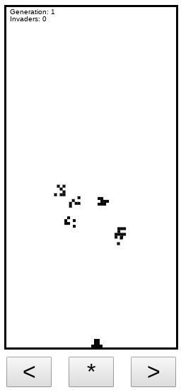

# InvaderZ

InvaderZ is like the game Space Invaders, except InvaderZ uses the [genetic algorithm](https://en.wikipedia.org/wiki/Genetic_algorithm) to mutate the invaders as you play.

If you want to see a live version of it, it's hosted [here](https://victorribeiro.com/invaderz).

My hosting provider is blocking access from India and Russia due to hacker attacks, so I'm providing an [alternative link](https://victorqribeiro.github.io/invaderz).

You can also add it as an app to your phone (menu / add to home screen), if you wish so.

## How to Play

Left arrow or A keys - move the cannon to the left

Right arrow or D keys - move the cannon to the right

Space bar  - Shoots; 

IF you are on your phone or tablet, use the buttons

## About

You are the last hope of the human kind as the defense against the InvaderZ. They are deployed by their mothership with the sole purpose of entering earth's atmosphere. Although they are not a danger for you as an individual, if 5 of them gets through, everything is doomed. You can only shoot one projectile at the time, so be mindful, as you are not getting another shot until the last fired projectile disperse into the space or hits a target. Each InvaderZ has a shape that influence how they move. When a InvaderZ dies, they upload their progress to the mothership, so it can generate more InvaderZ like the ones who did well before. After each 7 generations of InvaderZ, the mothership generates a complete new wave of InvaderZ keeping only the very best of the last past 7 generations.

## Genetic Algorithm

A random population of InvaderZ are generated at the beginning of the game. 

The fit score of the InvaderZ is how far it made through the earth's atmosphere. 

The way they move are directly related to their body shape. 

After they die, a new wave of InvaderZ are created by crossing over the InvaderZ with the higher fit score. 

The cross over could happen of 6 different forms:

* First horizontal half of the first parent with the second horizontal half of the second parent.
* First horizontal half of the second parent with the second horizontal half of the first parent.
* First vertical half of the first parent with the second vertical half of the second parent.
* First vertical half of the second parent with the second vertical half of the first parent.
* Odd genes from the first parent, even genes from the second parent.
* Even genes from the first parent, odd genes from the second parent.

There's a 10% chance of mutation after each cross over, altering their body shape and so the way they move. 

To keep things interesting, after 7 generations, a new wave is created from scratch and only the best of the 7 past generations is keep.

